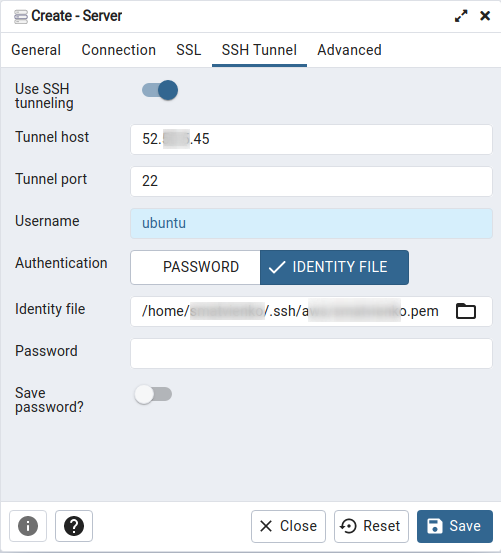

### Monitor the PostgreSQL with the PgAdmin

To monitor PostgreSQL database we are going to use the pgadmin. Here is how to [download and install pgadmin](https://www.pgadmin.org/download/).  
Open pgadmin  

Create a new connection like shown below. As example, we are going to connect to the AWS EC2 instance with SSH tunneling feature. The host name is the localhost for that case.

The default PostgreSQL user is thingsboard, default password is postgres. Please, put your credentials here instead of default.

To use SSH tunneling, put your Thingsboard instance IP and identity file (same as using to connect from terminal) for AWS EC2 instance.

As result, you can see the dashboard with real time PostgreSQL metrics.

Notice: if you are running the PostgreSQL in container isolated from host network, your connection will come with internal docker IP and you should configure security configuration in the [pg_hba.conf](https://www.postgresql.org/docs/current/auth-pg-hba-conf.html) file.